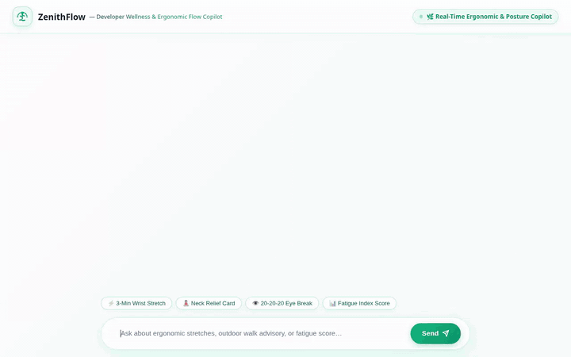

# ZenithFlow — Developer Wellness & Ergonomic Flow Copilot 🌿

> Real-time Posture & Flow Assistant built with Google ADK, Agent Engine, and A2UI.



## 🌟 Overview

**ZenithFlow** is an intelligent ergonomic copilot designed specifically for software engineers. It actively tracks physical strain points (neck, wrist, lower back, shoulder pain), coding habits, and hydration/fatigue levels to deliver personalized micro-stretch routines, break schedules, and real-time posture advice.

### ✨ Key Features
- **🌿 Ergonomic Strain Memory**: Long-term memory tracking of developer physical strain points across sessions.
- **🎨 Visual Mobility Illustrations**: Dynamic generation of high-quality ergonomic stretch illustrations using Imagen.
- **🎬 Omni Motion Previews**: 4-second realistic video mobility previews generated on-demand via Google GenAI Omni model (`gemini-omni-flash-preview`).
- **📱 A2UI Rich Display Cards**: Rendered dynamically using A2UI (version 0.8) cards, columns, images, and video players.
- **⚡ Developer Fatigue Index Calculator**: Code execution sandbox calculation for hydration and fatigue scores.
- **💾 Firestore Wellness Logging**: Persistent tracking of daily ergonomic logs and stretch routines.

---

## 🏗️ Project Architecture

```
zenith-flow/
├── app/
│   ├── agent.py               # Main ZenithFlow ADK agent logic & tool definitions
│   └── a2ui_utils.py          # A2UI v0.8 response callback & media sanitizer
├── frontend/                  # Modern Glassmorphic Web App (Cloud Run)
│   ├── main.py                # FastAPI proxy server (A2A protocol interface)
│   └── static/
│       └── index.html         # Responsive chat UI with native A2UI HTML5 video renderer
├── demo.gif                   # Recorded demo animation of ZenithFlow
└── agent_demo.webm            # High-definition WebM recording with Google Lyria audio
```

---

## 🚀 Running Locally

1. **Install Dependencies**:
   ```bash
   uv sync
   ```

2. **Start the Frontend Server**:
   ```bash
   cd frontend
   AGENT_ENGINE_RESOURCE_NAME="<your-agent-engine-resource-name>" AGENT_DIRECTORY="app" python3 -m uvicorn main:app --host 0.0.0.0 --port 8080
   ```
3. Open `http://localhost:8080` in your browser.

---

## ☁️ Deployment

- **Agent Engine**: `agents-cli deploy --project <project-id> --region us-east1`
- **Frontend App**: `gcloud run deploy zenith-flow-frontend --source ./frontend --region us-east1 --allow-unauthenticated`
